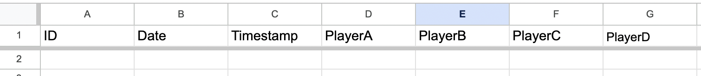
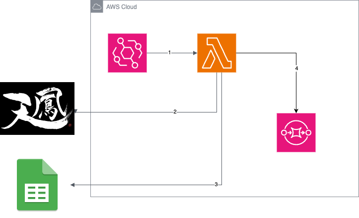

# Mahjong Score Collector

This repository contains a system for automatically collecting Mahjong scores and transferring them to a spreadsheet.

## About

The Mahjong Score Collector is designed to automate the process of collecting Mahjong scores from [天鳳](https://tenhou.net/sc/raw/) and transferring them to a spreadsheet. 

## Features

- Automatically collects Mahjong scores.
- Transfers scores to a spreadsheet automatically.

## Prerequisite

1. You have to enable to use the sheets API
You can see how to do it below link
https://gist.github.com/AnalyzePlatypus/a486323a331c91f738f2245ff9a1c66f

2. Set the sheet & Header like this

You can set the first sheet Header for 3 players mode.
You have to set PlayerName matches the player name you use in Tenho
|ID|Date|Timestamp|PlayerA|PlayerB|PlayerC| ...more |
|:-:|:-:|:-:|:-:|:-:|:-:|:-:|



You can set the second sheet Header for 4 players mode.
You have to set PlayerName matches the player name you use in Tenho
|ID|Date|Timestamp|PlayerA|PlayerB|PlayerC|PlayerD|...more|
|:-:|:-:|:-:|:-:|:-:|:-:|:-:|:-:|

3. You create and set environment value in env.json

```json
{
  "MahjongScoreLambdaFunction": {
    "GOOGLE_SERVICE_ACCOUNT_EMAIL": "",
    "GOOGLE_PRIVATE_KEY": "",
    "GOOGLE_SHEET_ID": "",
    "TENHO_ROOM_NUMBER": ""
  }
}

```

4. Docker installed and running
5. AWS SAM CLI installed

## How to run

1. npm run sam:build
2. npm run sam:invoke

## How to test

1. npm run test

## Infrastructure
